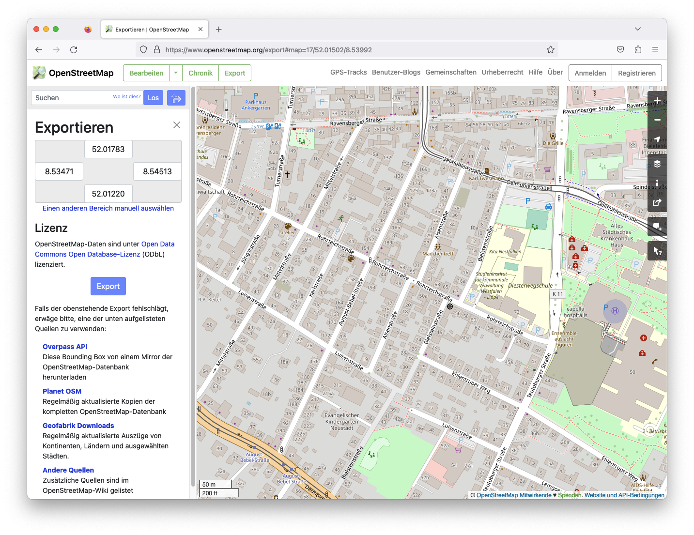
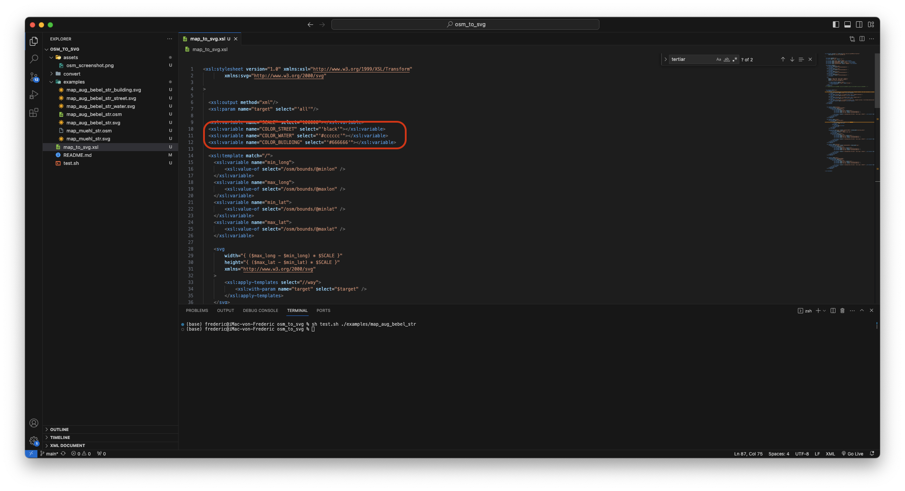
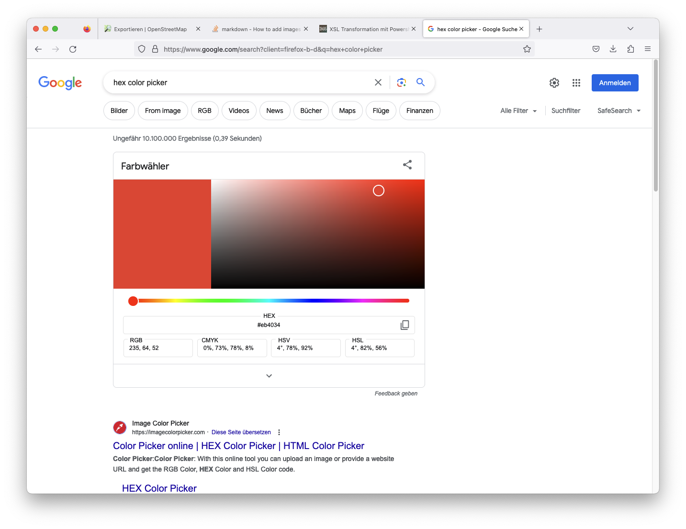

# osm_to_svg

## Andwendung
Nachfolgend eine kurze Erläuterung, wie mit Hilfe dieses Programmes ein Ausschnitt aus der Open Street Map in eine SVG-Datei umgewandelt werden kann.

### Export aus Open Street Maps
Als erstes kannst du dir über https://www.openstreetmap.org den von dir gewünschten Kartenausschnitt auswählen. Wichtig ist, dass du über openstreetmap.org gehst und nicht openstreetmap.de. Dort gibt es den Exportbutton nicht.
Dann im nächsten Schritt Erst oben in der Werkzeugleiste auf Export und danach im Menü links auf Export klicken.

### OSM-Datei kopieren
Als nächstes die heruntergeladene OSM-Datei in den convert-Ordner kopieren. Ich empfehle außerdem, die Datei mit einem aussagekräftigen Namen zu versehen.

### execute.bat ausführen
Zum konvertieren die Datei "execute.bat" mit Doppelklick ausführen. Sobald das Terminalfenster wieder verschwindet, ist die Konvertierung abgeschlossen. Das Script legt pro osm-Datei vier svg-Dateien im convert-Ordner an. Je eine Datei nur mit Straßen, Gebäuden und Wasser und dazu eine Datei mit allen layern kombiniert.

### Farben anpassen
Falls dir die Farben der einzelnen Elemente nicht zusagen, kannst du dich Farben in der Datei "map_to_svg.xsl" anpassen. Hier in den markierten Zeilen die Werte hinter select anpassen.

Es sollten hexadezimal-Farbwerte verwendet werden. Es gibt ohne Ende Colorpicker im Internet, in denen man meist auch hexadezimal-Farbwerte kopieren kann. Zum Beispiel reicht es schon, einfach "hex color picker" zu googlen.

